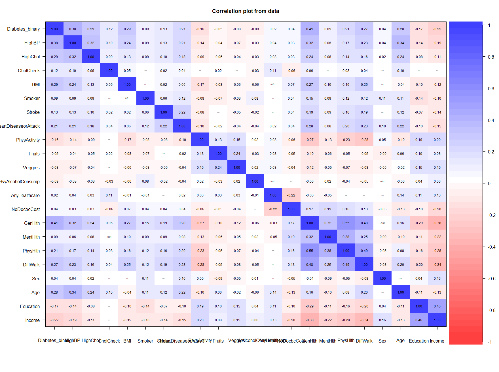
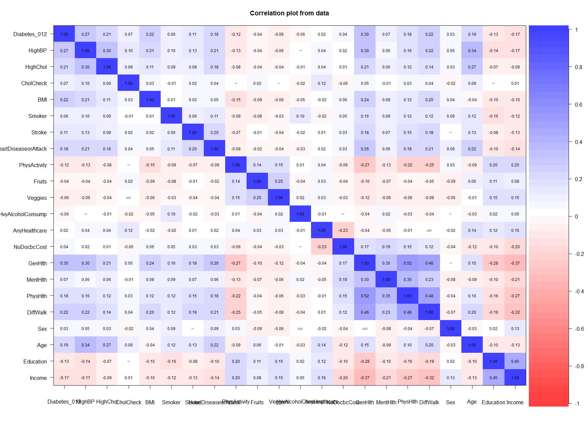

</br>
In this markdown we will use the **Diabetes Health Indicator Dataset** in-order to
make some predictions on a person having diabetes based on his/her health condition.
</br>
First we implement all the requiered libraries in the below section. we will answer
the questions afterwards...

```{r}
library(ggplot2)
library(vioplot)
library(ggpubr)
library(GGally)
library(psych)
library(caTools)
library(ROCR)
library(randomForest)
library(xgboost)
library(e1071)
```
</br>

now we load the data
```{r}
data1 <- read.csv("./datasets/diabetes_binary_health_indicators_BRFSS2015.csv")
data2 <- read.csv("./datasets/diabetes_binary_5050split_health_indicators_BRFSS2015.csv")
data3 <- read.csv("./datasets/diabetes_012_health_indicators_BRFSS2015.csv")
```

throughout this markdown we will check the performance of our models for all 3 datasets.
</br>
now let's take a look at the data!

```{r}
print(paste("dimension of the 1st dataset: " ,dim(data1)))
print("first rows of the 1st dataset")
head(data1)
print("number of unique diabetes/non-diabetes occurances")
table(data1$Diabetes_binary)
```

```{r}
print(paste("dimension of the 2snd dataset: " ,dim(data2)))
print("first rows of the 2nd dataset")
head(data2)
print("number of unique diabetes/non-diabetes occurances")
table(data2$Diabetes_binary)
```

```{r}
print(paste("dimension of the 3rd dataset: " ,dim(data3)))
print("first rows of the 3rd dataset")
head(data3)
print("number of unique diabetes/non-diabetes occurances")
table(data3$Diabetes_binary)
```

now we will check if there are any duplicate rows

```{r}
duplicates1 <- sum(duplicated(data1))
p1 <- duplicates1 / nrow(data1)
duplicates2 <- sum(duplicated(data2))
p2 <- duplicates2 / nrow(data2)
duplicates3 <- sum(duplicated(data3))
p3 <- duplicates3 / nrow(data3)
print(paste("Number of duplicate rows in the first dataset: ", duplicates1, "which is ", p1*100,"%"))
print(paste("Number of duplicate rows in the second dataset: ", duplicates2, "which is ", p2*100,"%"))
print(paste("Number of duplicate rows in the third dataset: ", duplicates3, "which is ", p3*100,"%"))
```

we can see that a little, but noticeable, portion of data is duplicated. however it doesn't have a problem because this data is gathered by asking people about their conditions and duplicates are completely natural.
</br>

now we will check if there are any *NA* rows in the data

```{r}
null1 <- sum(is.na(data1))
null2 <- sum(is.na(data2))
null3 <- sum(is.na(data3))
print(paste("Number of not available rows in the first dataset: ", null1))
print(paste("Number of not available rows in the second dataset: ", null2))
print(paste("Number of not available rows in the third dataset: ", null3))
```

as we can see there are no *NA* rows so we can continue without worrying about missing data.
</br>

now let's see the number of distinct values in each column of our data

```{r}
distinct_values <- function(data_frame) {
  for (col in colnames(data_frame)) {
    distinct_count <- length(unique(data_frame[[col]]))
    print(paste("Column:", col, "number of distinctvalues:",
                distinct_count))
  }
}
```

```{r}
print("-Dataset1-")
distinct_values(data1)
print("-Dataset2-")
distinct_values(data2)
print("-Dataset3-")
distinct_values(data3)
```

as the final step of our *pre-processing* stage we will take a look at the summary of all datasets

```{r}
summary(data1)
summary(data2)
summary(data3)
```

before we go further, we make a small change in our dataframes. it is required because we want to draw plots

```{r}
data1$Diabetes_binary <- as.factor(data1$Diabetes_binary)
data2$Diabetes_binary <- as.factor(data2$Diabetes_binary)
data3$Diabetes_012 <- as.factor(data3$Diabetes_012)
```


now we will take a deeper look to our data and do some exploratory analysis
</br>

first let's take a look at the distribution of data according to each parameter. we use violin plots for this purpose.

```{r}
par(mfrow = c(1, 3))
for (col_ in colnames(data1)){
  if (col_ == "Diabetes_binary"){
    next
  }
  
  vioplot(data1[[col_]], col = "yellow", border = "black",
  horizontal = FALSE, xlab = "dataset1", ylab = "Values",
  main = col_)
  
  vioplot(data2[[col_]], col = "orange", border = "black",
  horizontal = FALSE, xlab = "dataset2", ylab = "Values",
  main = col_)
  
  vioplot(data3[[col_]], col = "red", border = "black",
  horizontal = FALSE, xlab = "dataset3", ylab = "Values",
  main = col_)
}
```

now that we have some idea about the distribution of each variable, let's compare the distribution of each variable with seperated responses. we do this to see if there is a meaningful difference in the distribution. and we use KDE plots this time

```{r}
for (i in 2:22){
  
  colnames(data1)[i]
  
  p1 <- ggplot(data1, aes(x = data1[, i], fill = Diabetes_binary)) +
    geom_density(alpha = 0.4) +
    ggtitle("from data1") +
    labs(x = colnames(data1)[i])
  
  p2 <- ggplot(data2, aes(x = data2[, i], fill = Diabetes_binary)) +
    geom_density(alpha = 0.4) +
    ggtitle("from data2") +
    labs(x = colnames(data2)[i])
  
  p3 <- ggplot(data3, aes(x = data3[, i], fill = Diabetes_012)) +
    geom_density(alpha = 0.4) +
    ggtitle("from data3") +
    labs(x = colnames(data3)[i])
  
  print(p1)
  print(p2)
  print(p3)
}
```

as we can see, there are some obvious and meaningful difference in the
distribution for some of the parameters. however this is just some fancy
visualization and we will perform feature importance stuff in future inorder
to understand what parameters are actually important.
</br>

as the final step of our EDA, we will do a multivariate analysis in order to see the correlations between the parameters

```{r}
# we undo the change that we have made
data1$Diabetes_binary <- as.numeric(data1$Diabetes_binary) - 1
data2$Diabetes_binary <- as.numeric(data2$Diabetes_binary) - 1
data3$Diabetes_012 <- as.numeric(data3$Diabetes_012) - 1
```


```{r}
# this corplots are not so readable because of their size
# I will put their images respectively so that you have a better view
corPlot(data1, cex = 0.5)
corPlot(data2, cex = 0.5)
corPlot(data3, cex = 0.5)
```

```{r echo=FALSE, out.width='100%'}



```

now our EDA stage is also done. we have a good understanding of what our data is and we have some information about different variables. here we will briefly mention some of the key points.
</br>

in the beginning we have drawn all the violin plots for all of our datasets. we can see that the distribution of data in our datasets is almost the same. there are only 2 parameters (GenHlth, Age) that have very minor differences in their distribution which would not affect the model output that much.
</br>

then we have the KDE plots showing the distribution of the variables referring to different response variable. we did this so that we understand which variables have a meaningful difference in their distributions and can be used for our model parameters. we can see different patterns here. if the plots are like each other, then that variable doesn't affect the outcome that much (for instance Education) and vice versa.
</br>

afterwards we have the correlation plots. in these plots we can see that the variables HighBP, HighCol, BMI, GenHlth, DiffWalk, Age and HeartDisease have the most significant correlation with diabetes. we can also infer that the variables GenHlth, DiffWalk, PhysHlth, Age, Education and Income have a colorful row and have a somehow noticeable correlation with most of the variables.
</br>

and finally we have the pairplot. I will put the code that I used to get this plot, but it's commented because the computation of this plot is very time consuming and resource demanding (it took me around *3 hours* to get all 3 of them!) and I will put the picture of them instead.

```{r}
# plot1 <- ggpairs( data1 )
# ggsave(filename = "/content/plot1.png", plot = plot1, width = 100, height = 50, limitsize = FALSE)
# print("done!")
# plot2 <- ggpairs( data2 )
# ggsave(filename = "/content/plot2.png", plot = plot2, width = 100, height = 50, limitsize = FALSE)
# print("done!")
# plot3 <- ggpairs( data3 )
# ggsave(filename = "/content/plot3.png", plot = plot3, width = 100, height = 50, limitsize = FALSE)
# print("done!")
```

here are the plots respectively:

```{r}
knitr::include_graphics('./plots/plot1_1.png')
knitr::include_graphics('./plots/plot2_1.png')
knitr::include_graphics('./plots/plot3_1.png')
```

first let's explain what's going on in this massive shape! the boxes along the diagonals display the density plot for each variable ,and the boxes in the lower-left corner display the scatterplot between each pair of variables. The boxes in the upper right corner display the Pearson correlation coefficient between each variable. as we know the Pearson correlation gives us the measure of the linear relationship between two variables. It has a value between -1 to 1, where a value of -1 signifies a total negative linear correlation, 0 signifies no correlation, and +1 signifies a total positive correlation. it's too hard to explain this figure, considering the fact that it's giving us a ton of info on our data, but we can find out the pairwise correlation between our variables and also there is the scatterplot of our variables which can give us good insight on the relationship between different variables.
</br>

there is only one thing that I'd like to mention before we go for the model. as we saw above, the shape of variables in the 3 datasets that we have are almost the same and the differences can be ignored. we also know that before we train our models it's better that we normalize the data. which means we should balance the scale of our data and the number of data points referring to different target variables should be fairly equal. or else our model will be biased. as we have seen in the beginning of this notebook, the response variables are extremely unbalanced and almost 90% of the data in data1 and data3 dataframes are referring to non-diabetic people. so we won't be able to get a good and useful fit from them and the model will be heavily biased
if we use those datasets. considering all of that, we will train our models using the balanced, 50-50 dataset.
</br>

first we will set a seed so that the results be reproducible
```{r}
set.seed(12)
```

The first model that we are going to use in logistic regression

```{r}
# Splitting dataset
split <- sample.split(data2, SplitRatio = 0.8)

train_set <- subset(data2, split == "TRUE")
test_set <- subset(data2, split == "FALSE")

# Training model
logistic_model <- glm(Diabetes_binary ~ ., 
                      data = train_set, 
                      family = "binomial")
logistic_model
summary(logistic_model)
```

```{r}
# evaluating performance on test
predict_reg <- predict(logistic_model, 
                       test_set, type = "response")

# applying the 0.5 threshold
predict_reg <- ifelse(predict_reg > 0.5, 1, 0)

# Evaluating model accuracy
# using confusion matrix
table(test_set$Diabetes_binary, predict_reg)

missing_classerr <- mean(predict_reg != test_set$Diabetes_binary)
print(paste('Accuracy =', 1 - missing_classerr))
```

```{r}
# ROC-AUC Curve
ROCPred <- prediction(predict_reg, test_set$Diabetes_binary) 
ROCPer <- performance(ROCPred, measure = "tpr", 
                             x.measure = "fpr")
   
auc <- performance(ROCPred, measure = "auc")
auc <- auc@y.values[[1]]
   
# Plotting curve
plot(ROCPer, colorize = TRUE, 
     print.cutoffs.at = seq(0.1, by = 0.1), # the threshold
     main = "ROC CURVE")
abline(a = 0, b = 1)

auc <- round(auc, 4)
legend(.6, .4, auc, title = "AUC", cex = 1)
```

as we can see, we have almost 74.4% accuracy with the logistic regression model which is quite good. also the AUC is 0.7446 which means our model is performing pretty well.
</br>

now let's try other models to see if we can get a higher accuracy. now we will use random forest

```{r}
# first we will convert the target value to be categorical
# so that we can implement the random forest algorithm

data2_factor <- data.frame(data2)
data2_factor$Diabetes_binary <- as.factor(data2_factor$Diabetes_binary)

split <- sample.split(data2_factor, SplitRatio = 0.8)

train_set <- subset(data2_factor, split == "TRUE")
test_set <- subset(data2_factor, split == "FALSE")

classifier_RF = randomForest(Diabetes_binary ~ ., data = train_set,
                             mtry = 5, importance = TRUE)

classifier_RF

y_pred = predict(classifier_RF, newdata = test_set)

confusion_mtx = table(test_set$Diabetes_binary, y_pred)
confusion_mtx
```

now let's see the variable importance according to random forest

```{r}
importance(classifier_RF)
```


now we will draw a plot of our random forest model and calculate the MSE

```{r}
plot (y_pred, test_set$Diabetes_binary,
      xlab = "prediction", ylab = "true value")

missing_classerr <- mean(y_pred != test_set$Diabetes_binary)
print(paste('Accuracy =', 1 - missing_classerr))
```

we see that the accuracy is approximately 74.7%. so the random forest model couldn't improve our accuracy that much.
</br>

now let's go and try another model. we will try XGBoost and see if there will be any improvement

```{r}
split <- sample.split(data2, SplitRatio = 0.8)

train_set <- subset(data2, split == "TRUE")
test_set <- subset(data2, split == "FALSE")

# separating predictor and response variables
train_x = data.matrix(train_set[, -1])
train_y = train_set[, 1]

test_x = data.matrix(test_set[, -1])
test_y = test_set[, 1]

# define final training and testing sets
xgb_train = xgb.DMatrix(data = train_x, label = train_y)
xgb_test = xgb.DMatrix(data = test_x, label = test_y)

watchlist = list(train=xgb_train, test=xgb_test)

# fit model and display training and testing data at each round
model = xgb.train(data = xgb_train, max.depth = 3, watchlist=watchlist,
                  nrounds = 200)
```

From the output we can see that the minimum testing RMSE is achieved at 85 rounds. Beyond this point, the test RMSE actually begins to increase, which is a sign that we’re overfitting the training data.
</br>

Thus, we’ll define our final model to use 85 rounds:

```{r}
final = xgboost(data = xgb_train, max.depth = 3, nrounds = 85, verbose = 0)
pred_y <- predict(final, test_x)

prediction <- as.numeric(pred_y > 0.5)

mse = mean((test_y - prediction)^2)
print(paste("MSE= ", mse))
print(paste("RMSE= ", sqrt(mse)))

missing_classerr <- mean(prediction != test_y)
print(paste('Accuracy =', 1 - missing_classerr))
```

as we can see, now we have 76% accuracy. which is quite good and we have progressed a bit comparing to the last 2 models :)
</br>

however I'm willing to try SVM as well. let's see how much accuracy we can get using SVM

```{r}
# we will use the same test/train set that was used in the above moel

svm_classifier = svm(formula = Diabetes_binary ~ .,
                 data = train_set,
                 type = 'C-classification', # binary classification
                 kernel = 'linear')

y_pred = predict(svm_classifier, newdata = test_set)

# Making the Confusion Matrix
cm = table(test_set$Diabetes_binary, y_pred)
cm

missing_classerr <- mean(y_pred != test_set$Diabetes_binary)
print(paste('Accuracy =', 1 - missing_classerr))
```

as we can see, the accuracy of the model with linear kernel is 75%. which is almost the same as all the previous models. let's see what happens if we change the kernel

```{r}
svm_classifier = svm(formula = Diabetes_binary ~ .,
                 data = train_set,
                 type = 'C-classification', # binary classification
                 kernel = 'radial')

y_pred = predict(svm_classifier, newdata = test_set)

# Making the Confusion Matrix
cm = table(test_set$Diabetes_binary, y_pred)
cm

missing_classerr <- mean(y_pred != test_set$Diabetes_binary)
print(paste('Accuracy =', 1 - missing_classerr))
```

as we can see, with the radial kernel the accuracy is 75.6% which is almost the same as before.
</br>

now let's answer the questions:</br>

q1- yes. although we have fitted so many models right now, I knew it from the beginning. because we have a great amount of training data and the variables are related to diabetes we can fit a good model.</br>

q2- We have multiple ways up there to find out which variables have the most effect in our outcome. I've said them when I was analyzing the correlation plot. also from the results of the variable importance that the random forest gave us, we can say that the variables HighBP, HighChol, BMI, GenHlth and age have significant importance.</br>

q3- yes. because as we see, atleast half of these variables are not that useful for the outcome of the model. for instance we can only use 8 parameters for our model and still get a good accuracy.</br>

q4- in my final models, I've put all the variables (except for random forest and XGBoost because their way is different). but I could have eliminated most of them. I didn't do that because it didn't improve the accuracy of my model and it didn't have a significant effect. and we all know that this variable selection can be easily implemented in code!</br>

q5- ofcourse. as we said in the previous answers, some variables can be eliminated, and without them our model will still provide the same accuracy. so if we want to make the forums easier and faster, we can only ask 8 or 9 questions from people, and give them a somewhat good estimate about their health condition. note that diagnosing diabetes is very important and we don't have so much room for mistakes. so even the accuracies that we managed to reach, wouldn't be enough in a real world scenario and a doctor is required to take any further action.</br>

**Thanks for reading my markdown!**